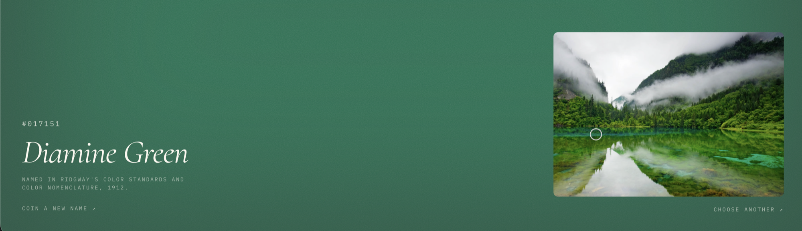

## Portfolio

### Nomenhue

A small, beautiful instrument for discovering what a color wants to be called.

[Live](https://nomenhue-ejdelsztejn.zocomputer.io/) · [GitHub](https://github.com/ejdelsztejn/nomenhue)

<video width="640" height="360" controls>
  <source src="assets/mov/nomenhue-demo.mp4" type="video/mp4">
</video>

Drop in an image and move your cursor across it. The entire page floods with the color beneath your pointer — not a flat fill, but pigment on a material: grain, a hue-tinted vignette, a warm lift in the darkest tones, all computed from the color's own luminance. Click to choose a color, and it is named. Every color is matched to its nearest neighbor among 1,227 public-domain names from two naturalists' color references. You can also request a fresh name and "Coin a new name" sends the hex and its nearest historical neighbors to GPT-4.1, which mints something new in the naturalists' voice.

#### Built with
Vite · React · TypeScript · Tailwind · Self-hosted fonts · Bun server for the production /api/coin route

## Selected Professional Work

Most of my production engineering work was completed in private repositories. These case studies describe the systems I helped build, the problems I worked on, and the technical decisions involved.

*Code is proprietary and the descriptions have been generalized.*

### Expanding Cyber-Risk Scan Coverage

Corvus’s cyber-insurance platform evaluated organizations’ publicly accessible infrastructure to identify vulnerabilities and inform underwriting and policyholder recommendations. One gap in the scanning process involved infrastructure discovered through MX DNS records, which identify the mail servers associated with a domain.

I worked across the platform’s Elixir services, PostgreSQL database, GraphQL APIs, and legacy Python integrations to incorporate MX-discovered assets into the scanning workflow.

#### My contributions

- Added scanning support for IP addresses discovered through MX records.
- Verified MX coverage across a legacy Python vendor integration.
- Updated application queries and asset views to recognize and display the new asset origin.
- Extended automated underwriting checks to account for vulnerabilities found on email infrastructure.
- Built normalization and filtering logic for common hosted-email providers, accounting for inconsistent capitalization, formatting, and trailing characters.
- Added tests based on representative production scenarios to reduce the risk of false-positive underwriting decisions.

##### Outcome

The project expanded visibility into email-related infrastructure and gave underwriting and policyholder-facing systems a more complete picture of an organization’s external risk exposure.

**Technologies:** Elixir, PostgreSQL, GraphQL, Oban, Python, AWS

### Building a Policyholder Security Survey

External infrastructure scans provide valuable information, but they cannot reveal internal security practices such as multifactor authentication, employee training, or incident-response preparation. Corvus wanted to collect this information while also giving policyholders another meaningful reason to engage with its application.

I helped design and build a configurable survey system within the policyholder platform using Elixir, Elm, GraphQL, and PostgreSQL.

#### My contributions

- Designed the relational data model for survey types, sections, subsections, questions, answer options, and responses.
- Created and migrated the new database tables and populated them with the initial survey content.
- Built the GraphQL components needed to move survey data between the backend and Elm frontend.
- Developed an interactive progress tracker in which each question was represented by a navigable status indicator.
- Created clear answered and unanswered states so policyholders could understand their progress and return directly to incomplete questions.

##### Outcome

The survey gave Corvus a structured way to incorporate internal security practices into its risk picture while creating a more engaging policyholder experience. It shipped as part of a broader set of product improvements after which active policyholder engagement increased by 50%.

**Technologies:** Elixir, Elm, GraphQL, PostgreSQL