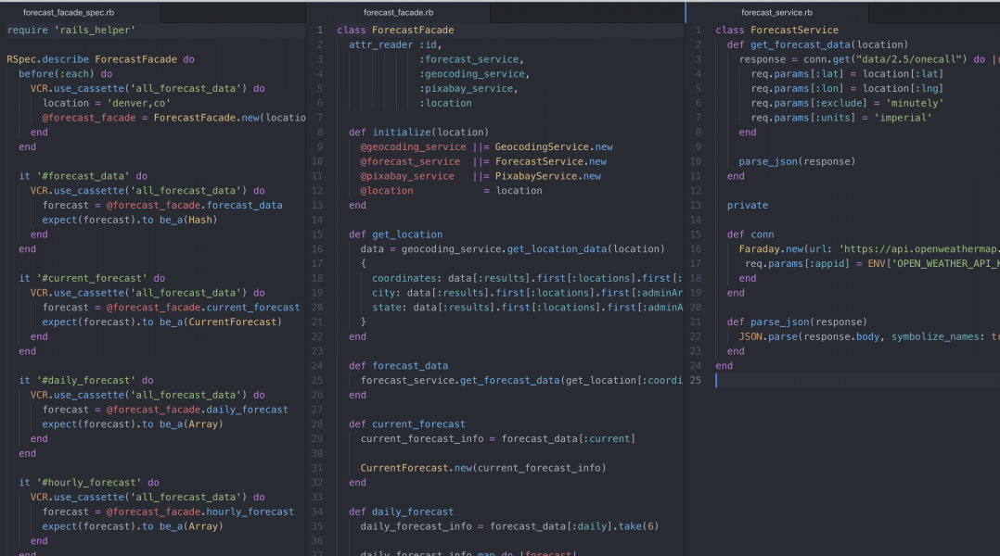

### MSET

[Repo](https://github.com/gabichuelas/mset_app) | [Application](http://mset-app.herokuapp.com/)

#### Overview

Medical treatments intended to address any variety of conditions all have something in common: there are always side effects to consider.

As a patient taking medication or exploring treatment options, it’s important to monitor the way a treatment is impacting you. However, with so many other things on our minds on a day to day basis, it can be challenging to be mindful of how medication is actually impacting you, resulting in missed patterns that are important for you and your medical provider to be aware of.

MSET (Medication Side Effects Tracker) allows you, as a medication user, to track side effects for a variety of medications and supplements in order to cultivate a mindful practice of tracking how a medical treatment is impacting you, in turn allowing you to provide your doctor with holistic feedback to guide your treatment plan.

The current iteration of MSET supplies an interface to track symptoms and side effects over time and allows you to take control of your medical treatment.

The idea for this app was pitched and exectued with a team of 4 over the course of 10 days.

Our team was invited to present MSET at Turing Demo Comp on October 6, 2020 (video of presentation [here](https://www.youtube.com/watch?v=JzkCOFQSIFQ).)

#### My Areas of Focus

- I created the CRUD functionality for medications and create the user's medication list, as well as the show page for each medication.
- I enhanced the user experience for logging a symptom via a more intuitive symptom search function, which utilizes a fuzzy string match Ruby library that uses the Jaro–Winkler distance to measure the edit distance between the search keyword and every symptom in the database.
- I designed the medication search function and how medication information should be retrieved from the API called. In particular, I parsed HTML using the Nokogiri gem to retrieve and organize potential medication side effects, which were otherwise not accessible without a thorough and complex parsing.

---

### Sweater Weather

[Repo](https://github.com/ejdelsztejn/sweater_weather)

#### Overview

Sweater Weather is a Ruby on Rails back-end REST API for a fictional road trip planning application. The app allows users to see the current weather at their destination, future forecasted weather at their destination, and additional information such as total navigation time, mileage, and an image of their destination.

#### My Areas of Focus

- I exposed an API that aggregates data from multiple external APIs and requires an authentication token.
- I ensured that the structure of all responses are JSON API 1.0 Compliant.
- I tested API calls using WebMock and VCR.
- I adhered to MVC design principals by organizing logic into intentional facade, PORO, model, serializer, and service files.

---

### Viewing Party
[Repo](https://github.com/ejdelsztejn/viewing_party) | [Application](http://viewing-party-paired-project.herokuapp.com/)

#### Overview

Viewing Party is an application to explore movies and create a viewing party event for you and your friends to watch a movie together. Users log into the application using Google OAuth and can explore the movie database thanks to the consumption of the MovieDB API.  Users can view information about movies, add friends to their account, and plan viewing parties with their friends that will be added as events to their Google Calendars.

#### My Areas of Focus

- I implemented basic user authentication using Google OAuth and utilized the Google Calendar AP to integrate the app with Google Calendar and enable users to add viewing parties to their calendars.
- I applied RuboCop’s style guide for code quality.
- I utilized Continuous Integration using Travis CI.
